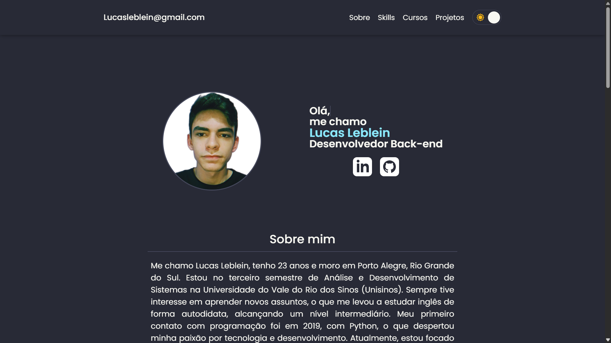

# Portfólio Web

Este é o meu portfólio web, onde compartilho um pouco sobre mim e apresento meus projetos e habilidades em desenvolvimento.

## 🌐 Acesse a versão online do meu portfólio
👉 [Visite meu portfólio online](https://lucas-ldev.github.io/)

## 🚀 Tecnologias utilizadas
 

## 🛠️ Recursos
- Seleção de tema (claro/escuro)
- Swiper (Carrossel de imagens)
- Responsividade para dispositivos móveis

## 🌟 Demonstração  
  
A imagem acima mostra uma prévia do design do meu portfólio.